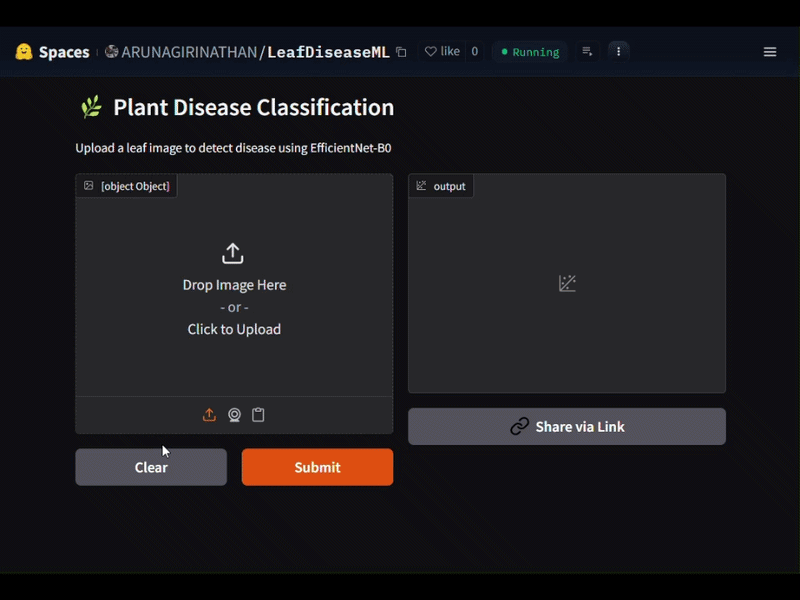
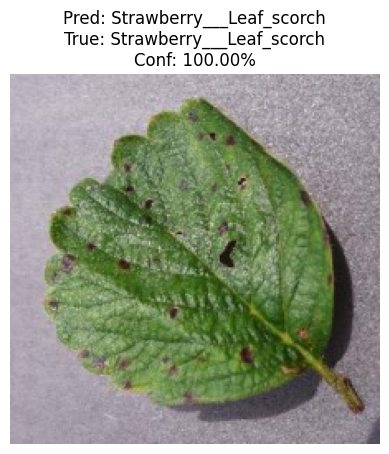
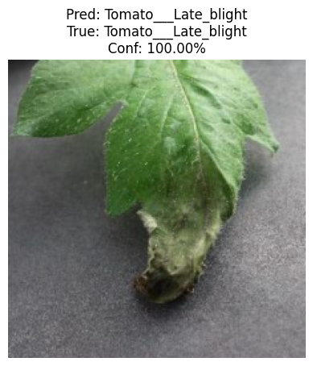
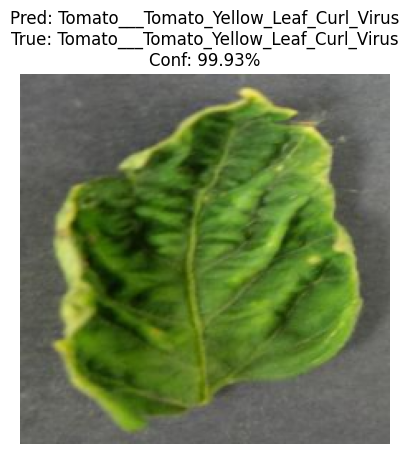
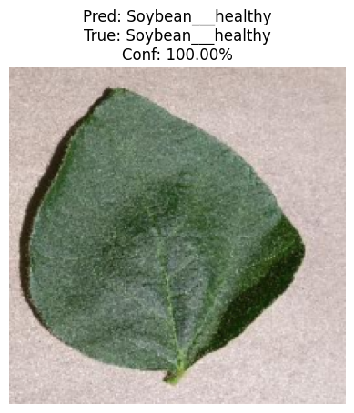
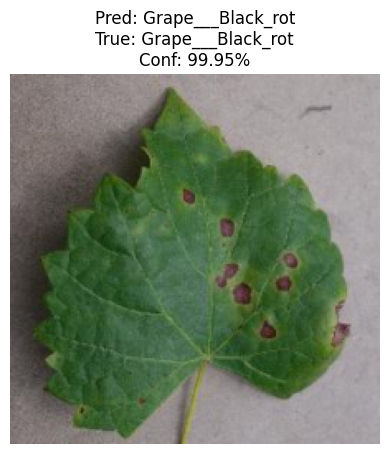
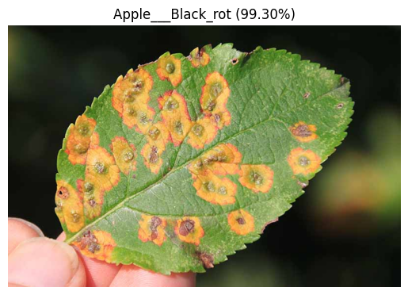

# 🌿 Plant Disease Classification Using CNNs

*Fine-tuned **EfficientNet-B0** model that detects **38 plant leaf diseases** from a single image — deployed live on Hugging Face Spaces.*

---

[](https://huggingface.co/spaces/ARUNAGIRINATHAN/LeafDiseaseML)
[](https://python.org)
[](https://pytorch.org)
[](https://gradio.app)
[](https://www.kaggle.com/code/arunsworkspace/plant-disease-cnn)
([view on Kaggle](https://www.kaggle.com/code/arunsworkspace/plant-disease-cnn))
---

## Transformers

```python
# Use a pipeline as a high-level helper
from transformers import pipeline

pipe = pipeline("image-classification", model="ARUNAGIRINATHAN/plant_disease")
pipe("https://huggingface.co/datasets/huggingface/documentation-images/resolve/main/hub/parrots.png")
```
```python
# Load model directly
from transformers import AutoModel
model = AutoModel.from_pretrained("ARUNAGIRINATHAN/plant_disease", dtype="auto")
```
---
## Dataset ([view on Kaggle](https://www.kaggle.com/datasets/abdallahalidev/plantvillage-dataset))
```python
import kagglehub
path = kagglehub.dataset_download("abdallahalidev/plantvillage-dataset")
```

- ~54,000 images across **38 classes** (healthy + diseased)
- Covers **14 crop species** (tomato, potato, corn, apple, etc.)
- Available on [Kaggle](https://www.kaggle.com/datasets/abdallahalidev/plantvillage-dataset) and [TensorFlow Datasets](https://www.tensorflow.org/datasets/catalog/plant_village)

## Demo



### Output 

<table>
	<tr>
		<td align="center" valign="middle"></td>
		<td align="center" valign="middle"></td>
		<td align="center" valign="middle"></td>
	</tr>
	<tr>
		<td align="center" valign="middle"></td>
		<td align="center" valign="middle"></td>
		<td align="center" valign="middle"></td>
	</tr>
</table>

## Flow


## Model
- **Architecture:** [EfficientNetB3](EfficientNet.md) (Transfer Learning + Fine-tuning)
- **Framework:** TensorFlow / Keras
- **Input:** 224 × 224 RGB leaf images
- **Output:** 38-class softmax prediction

## Tech Stack

| Component | Tool |
|-----------|------|
| Model | EfficientNet-B0 via `timm` |
| Framework | PyTorch |
| UI | Gradio |
| Deployment | Hugging Face Spaces |

## Hugging Face

---
title: LeafDiseaseML
sdk_version: 6.8.0
app_file: app.py
pinned: false
---

